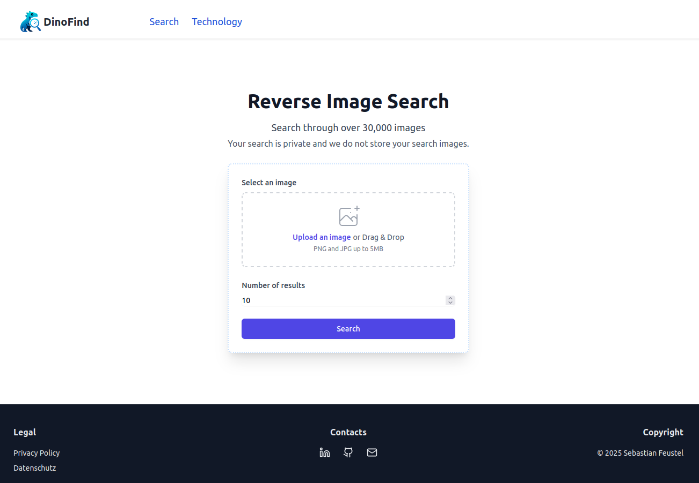

<div align="center">
    <h1> 🦕 Dinofind </h1>
    <p>⚡ A website that allows users to search for images based on images. 🔍</p>
</div>

<p align="center" style="padding: 5pt;">
    
    <a href="https://github.com/53845714nF/dinofind/actions/workflows/main.yml">
        
    </a>
    <a href="https://github.com/53845714nF/dinofind/actions/workflows/dependabot/dependabot-updates">
    
    </a>
</p>

<div align="center" style="padding-bottom: 2em">
    
</div>


This project is a minimal search for finding visually similar images.
It is an experimental project designed to explore the use of vector databases for image similarity search.


## ✨ Features

- Upload and vectorize in advance.
- Search for visually similar images.
- Store image metadata and embeddings efficiently.
- Scalable and modular architecture.

## ⚙ Components

The core components of the system include:

- [Kaggle](https://www.kaggle.com/datasets/adityajn105/flickr30k) is a Dataset of 30k Images from Flickr
- [DINOv2](https://github.com/facebookresearch/dinov2) as the image vectorizer to convert images into high-dimensional embeddings.
- [Qdrant](https://github.com/qdrant/qdrant) as the vector database for storing and querying image embeddings.
- [MinIO](https://github.com/minio/minio) as the object storage system to store the original image files.
- [Flask](https://github.com/pallets/flask) as the backend web service framework.

## 🚀 Getting started

Start with:

```bash
docker compose up
```

Uploade your Images:
Put your Images in the `images` Folder then run:

```bash
python3 -m venv .venv
source .venv/bin/activate
pip3 install -r requirements.txt
python -m upload.main
```

